# Reproduction of arXiv:2309.12402 with SDPB: comparison against the paper's figures

Bo Wang, Shi Qiu, Hua Xing Zhu. 14 September 2026.

## 1. What was done

These are the results of our attempt to reproduce *Bootstrapping gauge theories* (arXiv:2309.12402, v3), compared figure by figure with the paper.

We set the finite problem of Section 3 up directly as a polynomial matrix program and solved it with SDPB, at high precision; no other solver was involved. The discretised operators (grid and conformal map, cot kernel, angular projections of the Mandelstam representation, current kernels) were rederived from Sections 2 and 3 rather than taken from any existing code, and cross-checked with a Mathematica script. Every solution quoted below was re-verified against the original constraints in interval arithmetic (Arb) after the solve.

There are five numerical choices the paper does not spell out, and they turn out to matter for Figs. 8-10; the table lists them with the readings we tried.

| Item | Paper text | Readings run |
|---|---|---|
| Norm of the sum-rule tolerance (3.73), eps_SR = 2e-3 | "with some norm" | per-moment box on the raw moments (main line); per-wave L2 ball (the structure of the code released with the follow-up paper, arXiv:2403.10772); relative 10 % per moment |
| Evaluation point of the factor between F and script-F in (3.75) | "which we evaluate at s = s0" appears in the estimate of eps_FF | factor at each node s_i > s0 (main line); factor frozen at s0 |
| Regularisation of the double spectral density | not mentioned in 2309; the earlier method paper arXiv:2103.11484 (Section 3) and the code released with arXiv:2403.10772 use an M-bound | |rho_ij| <= Mreg with Mreg fixed by an in-model rule (omitted-wave unitarity and L-stability), Mreg = 1e2 for the chiral and UV stages, 1e3 for the pure stage; l2 and l4 controls; Mreg x 10 control |
| Selection of the amplitude at a boundary point | "only points at the boundary have partial waves associated with them" | the solver's optimal point, plus a diagnostic of the whole near-optimal face (Section 4) |
| Chiral norm in (3.64) | "with some norm" | one combined 8-dimensional L2 norm (as in the code released with arXiv:2403.10772); two separate 4-dimensional norms as a control |

Everything else is taken as printed: M = 50, phi_i = (i - 1/2) pi / M, nu_0 = 0, L = 10 waves per isospin, s0 = (1.2 GeV)^2, alpha_s = 0.4, m_u = 4 MeV, m_d = 7.3 MeV, the condensates (2.54), m_pi = 140 MeV, f_pi = 92 MeV, the printed sum-rule numbers (2.56) times s0^(n+2), eps_chi = 2e-3, eps_FF = 6e-5, chiral points s = 1/2, 1, 3/2, 2, moments n = 0, 1 (S0) and -1, 0 (P1).

## 2. Summary table

| Figure | Paper statement | Our result | Agreement |
|---|---|---|---|
| Fig. 3 | pure-unitarity region, M=50, L=10 | +x end 2.22445 vs 2.23289 (-0.4 %); -x end -2.247 vs -2.902; f11 range [-0.6243, 0.06629] vs [-0.7336, 0.07932] | +x end agrees; our region is inside yours on the -x and +-y sides (regulariser-sensitive directions) |
| Fig. 4 | chiral constraints collapse the region onto f11 = -f00/15 | eps_chi = 2e-3: +x end 0.082757 vs 0.0825728 (+0.2 %); x_ref section width 0.0007618 vs 0.0007598; six-tolerance ladder monotone | agrees |
| Fig. 5 | subthreshold waves nearly linear; S0 chiral zero moves with eps_chi | RMS <= 6.4 % of f00(3) against the digitised curves at eps_chi = 2e-3, 4e-3, 6e-3; S0 zero at 0.426 / 0.293 / absent | agrees |
| Fig. 7 | chiral-only phases: S0, S2 agree with experiment, P1 has no rho | RMS vs digitised curves S0 0.388 deg, S2 0.144 deg, P1 0.456 deg; no P1 crossing below 1.2 GeV | agrees |
| Fig. 8 | with the sum rules the upper boundary shrinks much more than the lower | upper shrink / lower rise at x_ref: 0.000277 / 0.000277 (node factor), 5.32e-05 / 0.000249 (frozen factor); paper 2.32e-4 / 3.7e-5. +x end 0.076013 / 0.079623 vs 0.08112 | the asymmetry does not appear in any feasible reading |
| Fig. 9 | P1 phase shift with the rho, 90-degree crossing about 6 % above 770 MeV | crossings: tip 772.7 MeV (|S| min 0.585), mid 738.9 MeV (|S| min 0.077), ref: |S| dips to 0.24 at 0.73 GeV (crossing at 708 MeV on the +180 deg branch); paper 813-827 MeV | a rho-like structure appears at every point once the UV constraints are added; it sits 40-110 MeV lower than yours and is strongly inelastic |
| Fig. 10 | S0 and S2 coincide at low energy and spread above | S2: RMS 0.354-1.44 deg, endpoints -28 to -32 deg (paper -18 to -36); S0: RMS 5.7-16.6 deg, endpoint at 1.196 GeV 181-192 deg (paper 87-106) | S2 agrees; S0 rises faster than yours above 0.6 GeV |
| Fig. 11 | good convergence in L; rho peak shifts with M | P1 crossing at M=50: L=8/10/12 771.4 / 772.7 / 772.9 MeV; L=10: M=45/50/60 736.1 / 772.7 / 738.8 MeV; S0 at 1 GeV 150-165 deg (paper about 95) | L-stability agrees; the M shift is 37 MeV; S0 level differs |

## 3. Figure-by-figure comparison

In each figure below the left (or upper) panel is the paper's figure rendered from the arXiv source, the right (or lower) panel shows our accepted solutions with the digitised paper curve or boundary overlaid.

### Fig. 3, pure unitarity region

Paper: "we have used M=50 in (3.61) for discretization and imposed unitarity for 10 partial waves per isospin."

Ours: 24 support directions at 15-degree steps, all accepted, M=50, L=10, Mreg = 1e3 (chosen by the omitted-wave rule: the six first omitted waves stay within |S| <= 1.02 at every node and the L=8/10/12 endpoints agree to 2 %). Extrema against the digitised figure: f00 max 2.22445 vs 2.23289 (-0.4 %), f00 min -2.247 vs -2.902, f11 min -0.6243 vs -0.7336, f11 max 0.06629 vs 0.07932. The +x end is insensitive to Mreg (2.2116 / 2.2245 / 2.2305 at Mreg = 1e2 / 1e3 / 1e4). The three other extrema lie inside your region by 15-23 %; these are the directions where the amplitudes are large and the |rho_ij| bound is active. We read this as a measurement of the unstated regulariser rather than of the model; a Mreg = 1e4 control for these three directions is running.

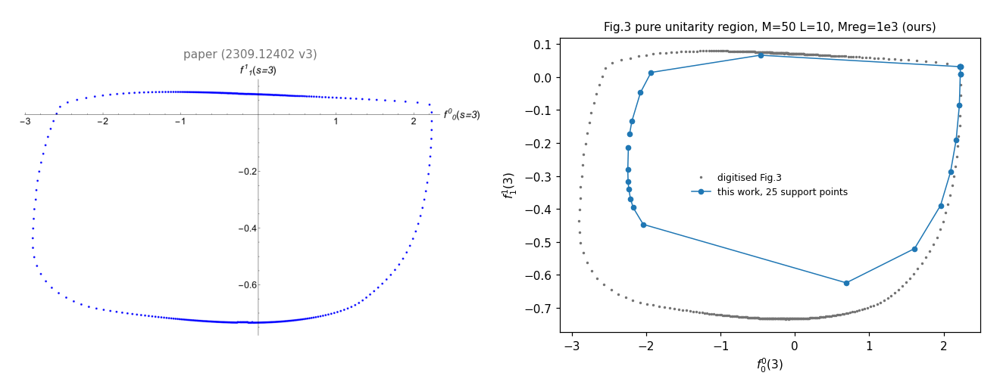
*Fig. 3: paper (left) and our 24 support points with the digitised boundary (right).*

### Fig. 4, chiral constraints

Paper: "restricted by the chiral constraints (3.64) with tolerances 6e-3, 4e-3, 2e-3, 1e-3, 6e-4, 2e-4 (from the outer shape inward) ... with some norm".

Ours: one combined 8-dimensional L2 norm on the four-point residuals (the packaging of the code released with arXiv:2403.10772), Mreg = 1e2. At eps_chi = 2e-3 the +x end is 0.082757 (paper 0.0825728, +0.2 %) and the vertical section at x_ref has width 0.0007618 (paper 0.0007598); the +x ends of the six tolerances decrease monotonically (0.1608, 0.1255, 0.0828, 0.0551, 0.0411, 0.0223 for eps_chi = 6e-3 ... 2e-4). The two-norm control (chi-c) moves the +x end by less than the ladder spacing.

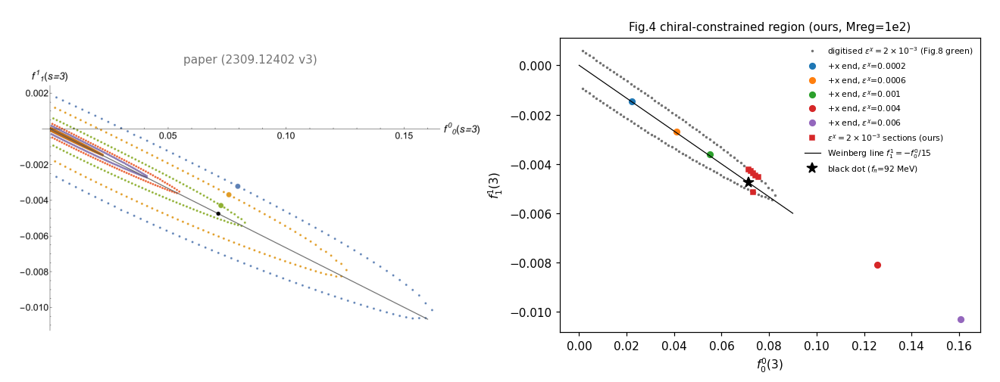
*Fig. 4: paper (left) and our six +x ends plus the eps_chi = 2e-3 sections with the digitised eps_chi = 2e-3 boundary (right).*

### Fig. 5, subthreshold partial waves

Paper: "For the larger tolerances the partial waves are not approximately linear ... the chiral zero of the amplitude disappears for the blue points. ... The value eps_chi = 0.002 ... allows the physical value of f_pi".

Ours: the curves are evaluated from the Arb coefficients of the accepted leaves on 0.05 <= s <= 3.95, at the upper-branch x_ref representative of each tolerance. RMS against your digitised curves is at most 6.4 % of f00(3) (threshold 8 %); the S0 zero sits at s = 0.426 (2e-3), 0.293 (4e-3) and is absent at 6e-3, as in the figure.

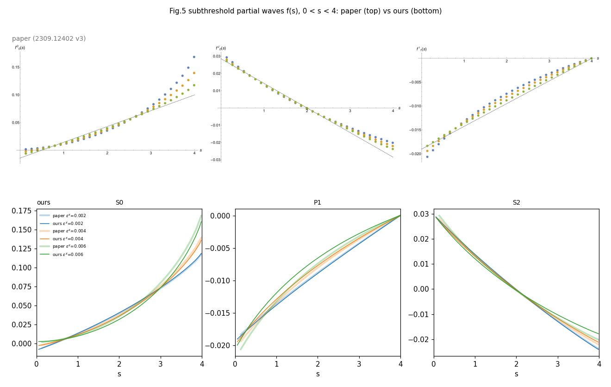
*Fig. 5: paper's three panels (top) and ours (bottom).*

### Fig. 7, chiral-only phase shifts

Paper: "We choose a point closest to the black dot ... The partial waves at the magenta point and other nearby agree very well with experimental values for the S0 and S2 waves but not for the P1".

Ours: the representative is chosen by a rule fixed before any phase was read (nearest upper-branch endpoint to the black dot among the vertical sections at x_ref + {-0.002, -0.001, 0, +0.001, +0.002}). RMS against your digitised curves: S0 0.388 deg, S2 0.144 deg, P1 0.456 deg; P1 has no 90-degree crossing below 1.2 GeV.

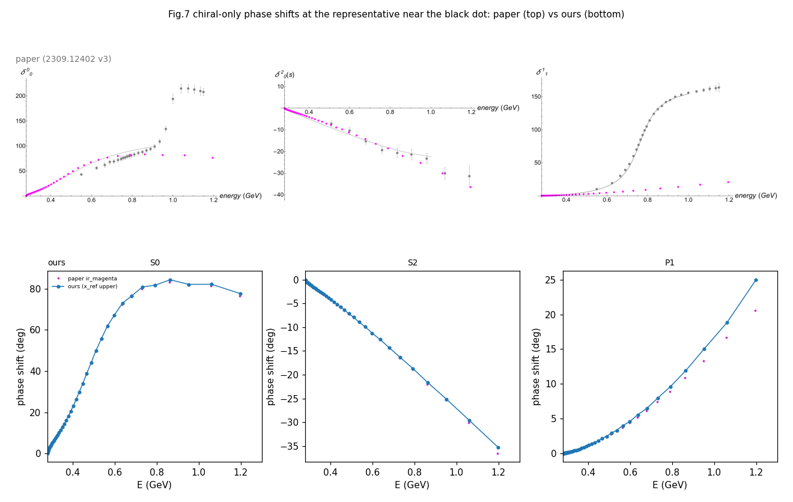
*Fig. 7: paper (top) and ours (bottom).*

### Fig. 8, region after the sum rules and the form-factor bounds

Paper: "the plots are produced by taking eps_SR = 2e-3 in (3.73) and eps_FF = 6e-5"; caption: "The upper boundary shrinks notable but the lower not so much."

Ours, three readings of eps_SR and two of the (3.75) factor (all values at the x_ref section, paper values from the digitised figure):

| Reading | UV +x end | upper shrink | lower rise | ratio |
|---|---|---|---|---|
| raw box 2e-3 per moment, factor at each node | 0.076013 | 0.000277 | 0.000277 | 1 |
| raw box, factor frozen at s0 | 0.079623 | 5.32e-05 | 0.000249 | 0.214 |
| per-wave L2 ball 2e-3, factor frozen at s0 | 0.079541 | 5.35e-05 | 0.00025 | 0.214 |
| paper | 0.08112 | 2.32e-4 | 3.7e-5 | 6.3 |

The relative reading (10 % of each moment) is infeasible in this model. We proved this by removing the S0 n=0 box, keeping the other three 10 % boxes and every other constraint, and minimising that moment: the minimum is 0.0037454 = 1.57 x the QCD value, so no point of the feasible set lies within 10 % of it. In the raw-box reading the accepted solutions sit at the upper edge of three of the four boxes (S0 n=0 at +84 % of its target, S0 n=1 at +1.8 %, P1 n=0 at +1.4 %): the sum rules bind, and they bind in the direction of larger spectral integrals.

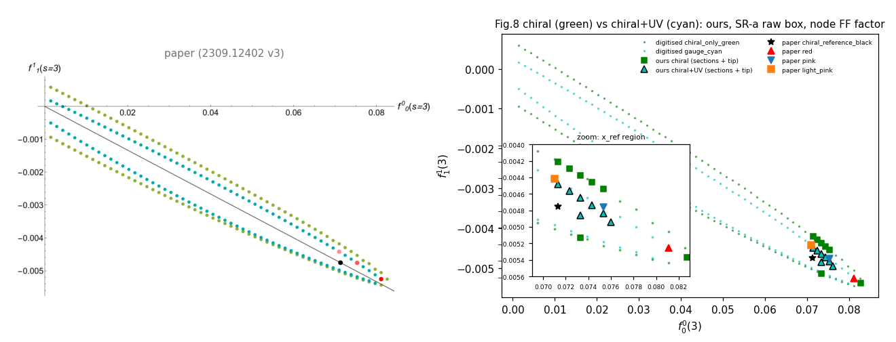
*Fig. 8: paper (left) and our chiral and chiral+UV boundary points with the digitised boundaries (right, with a zoom on the x_ref region).*

### Fig. 9, P1 phase shift

Paper: "The resonance energy where the phase shift crosses pi/2 is slightly shifted from the real world data on the mass of the rho at 770 MeV by roughly 6 %." Digitised crossings: 0.827, 0.824, 0.813 GeV.

Ours, at the three representatives of the same frozen rule (tip = +x end; ref = nearest upper-branch point to the black dot; mid = its neighbour towards the tip): tip crossing 772.7 MeV with |S_P1| = 0.585 at 0.79 GeV; mid 738.9 MeV with |S_P1| down to 0.077; ref: |S_P1| falls to 0.24 at 0.73 GeV, and the node values admit two phase branches (the nearest-node lift swings to -47 deg, the +180 deg branch crosses 90 deg at 708 MeV). With the chiral constraints alone (Fig. 7) there is no crossing below 1.2 GeV, so the resonance is produced by the sum rules and the form-factor bounds, as in the paper; its position is 40-110 MeV below yours and the wave is far from elastic there. The paper does not show |S|; we add it in the second panel.

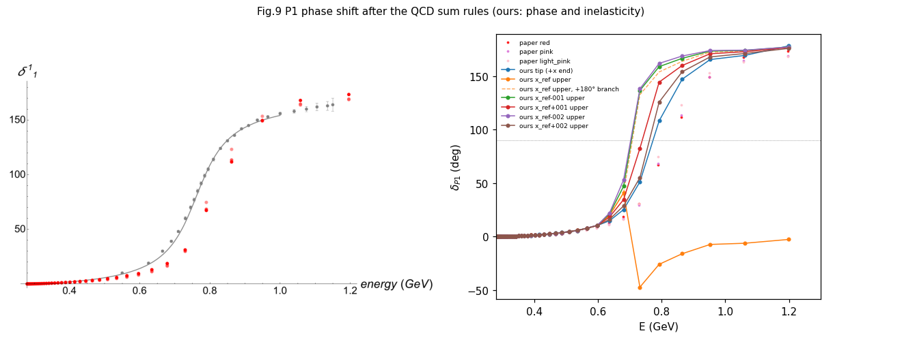
*Fig. 9: paper (left) and our P1 phases at the representatives with the three digitised curves (right).*

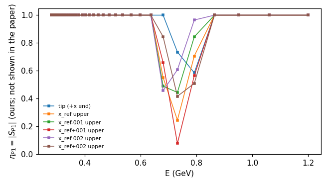
*|S_P1| at the same points (not shown in the paper).*

### Fig. 10, S0 and S2 phase shifts

Paper: "the three bootstrap (red, pink, light pink) curves ... coincide at low energy but they spread at high energy."

Ours: S2 agrees with your curves (RMS 0.354-1.44 deg, endpoints -28 to -32 deg at 1.196 GeV against your -18 to -36 deg). S0 agrees below about 0.6 GeV and then rises faster: it crosses 90 deg at 0.69 GeV and reaches 181-192 deg at 1.196 GeV, where your curves are at 87-106 deg. With the chiral constraints alone our S0 matches your Fig. 7 to 0.4 deg, so the difference is introduced by the UV constraints.

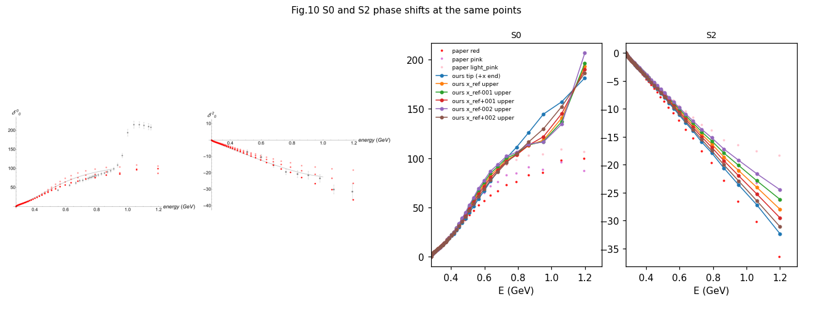
*Fig. 10: paper (top) and ours (bottom).*

### Fig. 11, dependence on M and L

Paper: "For M=50, we have plotted the results with L=8, 10, 12. In all three partial waves there is a reasonably good convergence. ... the P1 phase shifts show a rho resonance with the peak slightly shifted depending on M."

| (M, L) | UV +x end | P1 crossing (MeV) | min |S_P1| below 1.2 GeV | S0 at 1 GeV (deg) |
|---|---|---|---|---|
| (50, 8) | 0.076176 | 771.4 | 0.584 | 151 |
| (50, 10) | 0.076013 | 772.7 | 0.585 | 150 |
| (50, 12) | 0.075944 | 772.9 | 0.585 | 150 |
| (45, 10) | 0.074275 | 736.1 | 0.226 | 165 |
| (60, 10) | 0.075097 | 738.8 | 0.597 | 156 |

The L dependence is 1.5 MeV in the crossing and 0.3 % in the endpoint. The M dependence is 37 MeV, with M=45 and M=60 both below M=50; in your figure the ordering is M=60 < M=45 < M=50. The S0 level at 1 GeV is 150-165 deg at every configuration against about 95 deg in your figure.

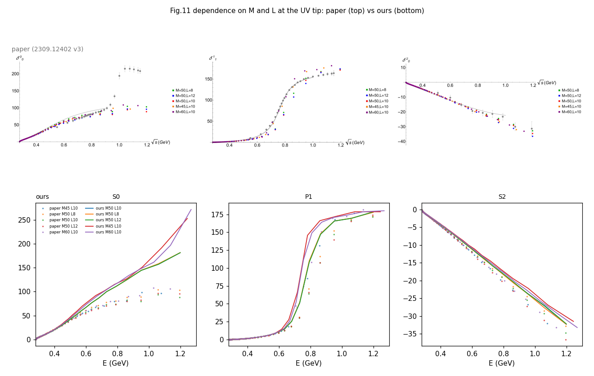
*Fig. 11: paper (top) and ours (bottom).*

## 4. Why the fine features of Figs. 8-10 do not follow from the stated problem

Two diagnostics were run on the accepted UV solutions. Both are exact up to the solver tolerance and were registered before the runs.

(a) Near-optimal face. At a boundary point with support direction d and optimal value v*, we add the constraint d.(f00, f11) >= v* - 2e-6 (twice the duality-gap threshold), keep the section, and maximise or minimise one node functional that is linear in the primal variables: 1 - Re S(s_i), Im S(s_i), Im F(s_i). The range of the functional over this slab shows how far the amplitude at that boundary point is determined by the extremal problem. Your Fig. 9 phases at the nodes 0.792 GeV (68.7-76.2 deg) and 0.864 GeV (112.8-124.1 deg) have cos 2 delta < 0, so any amplitude with those phases has 1 - Re S > 1 whatever |S| is.

| Representative | Functional | Range over the face | Consequence |
|---|---|---|---|
| tip (+x end) | 1 - Re S_P1 (0.792 GeV) | [1.441, 1.493] | pinned to +-0.03 around the tip's own value 1.470; below the 1.72-1.85 of your curves at |S| = 1 |
| tip | 1 - Re S_P1 (0.864 GeV) | max 0.6346 | below 1: your 112.8-124.1 deg excluded for every |S| |
| tip | Im S_P1 (0.792 GeV) | max -0.276 | negative on the whole face: every amplitude there is past the resonance at 0.79 GeV |
| x_ref upper (ref) | 1 - Re S_P1 (0.792 GeV) | [0.02279, 0.9356] | wide (undetermined), yet below 1 everywhere: your 68.7-76.2 deg excluded for every |S| |
| x_ref upper | 1 - Re S_P1 (0.864 GeV) | max 0.701 | below 1: excluded for every |S| |
| x_ref upper | Im F_1 (0.792 GeV) | [0.07843, 3.71] | the vector form factor is essentially free at this point |
| tip | 1 - Re S_S0 (0.792 GeV) | [1.59, 1.726] | the S0 phase is fixed at 111 deg on the face; only |S| varies (0.79-0.99) |

The tip face is rigid in the P1 observables and does not contain your P1 shape; the x_ref face is degenerate (the paper's premise that a boundary point carries one set of partial waves does not hold there) and still excludes your P1 phase at both nodes. Choosing a different point on these faces, or a different solver, cannot reproduce Fig. 9 from this constraint set.

(b) Regulariser scale. Raising Mreg from 1e2 to 1e3 moves the UV +x end by +0.9 %, the P1 crossing by -3.6 MeV and min |S_P1| by -0.025; the Fig. 8 asymmetry does not appear at either scale.

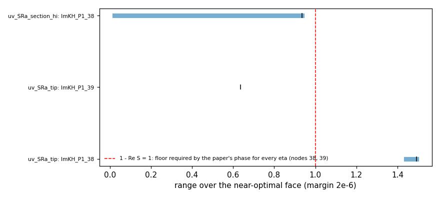
*Ranges of the node functionals over the near-optimal faces (bars) against the floor 1 - Re S = 1 required by the paper's phases (dashed).*

## 5. After the unitarity-saturation iteration

*"One thing we noticed, as you are saying, is that unitarity tends to be unsaturated near the resonance. The rho meson decays primarily to two pions so we used the iterations to correct that. ... Our results are always shown after that."* (your message of 17 September)

We implemented the step in the form of eq. (2.29) of the follow-up paper: every constraint of the finite problem is kept, the section f00(3) = x is released, and the objective is replaced by sum_k Re[e^{-2i alpha_k}(S_k - 1)] over the nodes below s0 of S0, P1 and S2, with alpha_k the phase of the previous form factor (the previous phase shift for S2); each round is a full SDPB solve with the same verification as before. We ran it from the three representatives of Fig. 9, for eight or nine rounds each, and as a control with the point held at its boundary position.

| Start | Rounds | (f00, f11) start -> end | min abs S_P1 | rho (MeV) | S0 at 1 GeV | S2 at 1.2 GeV |
|---|---|---|---|---|---|---|

| tip | 8 | (0.0760, -0.00494) -> (0.0678, -0.00449) | 0.585 -> 0.998 | 773 -> 775 | 150 -> 145 deg | -32.3 -> -24.8 deg |

| x_ref upper | 9 | (0.0733, -0.00465) -> (0.0627, -0.00416) | 0.244 -> 0.991 | none -> 714 | 128 -> 136 deg | -28 -> -18.1 deg |

| x_ref+0.001 upper | 9 | (0.0743, -0.00474) -> (0.0629, -0.00419) | 0.0766 -> 0.913 | 739 -> 741 | 132 -> 138 deg | -29.5 -> -18 deg |

The iteration does what it is meant to do: |S| reaches 0.90-1.00 at every node below s0 and the phases of F and S line up. It does so by leaving the boundary point (the amplitudes drift inwards by 11-15 % in f00 over eight or nine rounds and had not stopped; our convergence measure falls by about 10 % per round), and when the point is held fixed instead the same objective saturates very little: min |S_P1| goes 0.585 -> 0.593 at the tip and 0.244 -> 0.493 at x_ref. What it does not change is the rest of the picture: the rho crossings stay at 775, 714, 741 MeV (your 813-827), the S0 wave stays fast, the three chains do not approach one amplitude, and the S2 wave moves away from your curves. Your node weights 1/Lambda^2 change the drift, not the rho (714 against 713 MeV).

Re-applying our pre-registered rules for Figs. 9 and 10 to the iterated amplitudes: C6 FAIL (crossings ['775', '714', '741'] MeV, spread 61 MeV, band [795,845] False, min eta >= 0.9 True); C7 FAIL (S0 r.m.s. from your red curve 16.5, 8.29, 13.1 deg). Both verdicts remain as in Section 3.

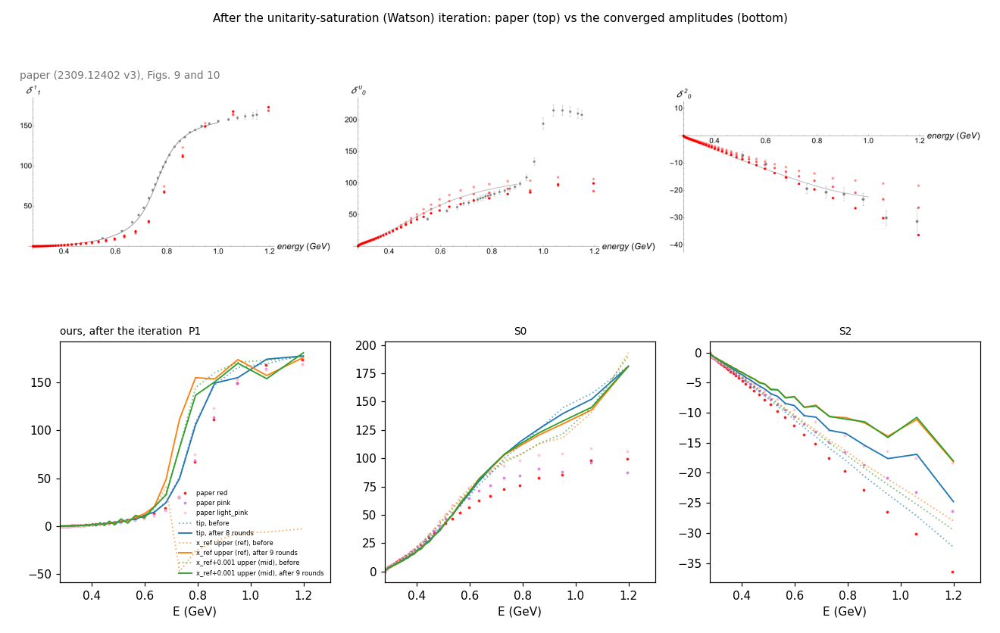
*Figs. 9 and 10 of the paper (top) and our amplitudes before (dotted) and after (solid) the saturation iteration (bottom).*

## 6. Sensitivity to the form-factor cap

*"The faster (or sometimes slower) rise of S0 happens, I believe, depending on the parameters. Also changes in the rho mass."* (same message)

The only continuous parameters of the UV stage are eps_SR and eps_FF. eps_SR does not matter: loosening the raw box from 2e-3 to 1e-2, or dropping the S0 n=0 box, moves the rho by at most 12 MeV and leaves S0 unchanged. eps_FF in (3.75) matters a great deal, and the two currents act independently.

| eps_FF | +x end | rho (MeV) | min abs S_P1 | S0 at 0.79/0.86/0.95/1.06 GeV |
|---|---|---|---|---|

| 6e-05 (both currents) | 0.076013 | 772.7 | 0.585 | 111/126/145/157 |

| 0.0001 (both currents) | 0.078351 | 849.1 | 0.785 | 92.5/107/123/146 |

| 0.00014 (both currents) | 0.079637 | 905.3 | 0.845 | 81.8/91.9/105/130 |

| 0.0002 (both currents) | 0.080779 | 972.3 | 0.973 | 73/81.7/88.3/111 |

| 0.001 (both currents) | 0.082753 | 1604 | 0.987 | 59.5/59.7/60.3/57.7 |

| S0 cap 2e-4, P1 cap 6e-5 | 0.077579 | 775.3 | 0.585 | 74.9/84/90.1/111 |

| S0 cap 6e-5, P1 cap 2e-4 | 0.07891 | 966.6 | 0.956 | 110/125/148/164 |

| S0 cap 2e-4, P1 cap 8e-5 | 0.078545 | 816.9 | 0.751 | 74.4/83.3/89.5/111 |

| paper | 0.0811 | 813-827 | - | 76/83/86/98 (red), 99/103/104/109 (light pink) |

With your stated 6e-5 the S0 wave is too fast and the rho too low. Loosening the S0 cap alone to 2e-4 puts S0 on your red curve to within 3 deg up to 0.95 GeV without touching the rho; loosening the P1 cap alone moves the rho up (about 850 MeV at 1e-4, 970 at 2e-4) without touching S0. Your figures therefore correspond to an effective constraint on the form factors above s0 that is looser than our reading of (3.75) with 6e-5, and looser for the scalar current than for the vector one. We have not retuned anything on the strength of this.

The pair this interpolation points to (S0 cap 2e-4, P1 cap 8e-5) was run as a pre-registered test (all three at once: +x end within 1 % of 0.0811, rho in 813-827 MeV, S0 within 10 deg of your red curve up to 1 GeV). It puts the rho at 817 MeV, S0 within 4 deg of your red curve up to 1 GeV (r.m.s. 1.9 deg) and S2 within 1 deg -- your Figs. 9 and 10 at the tip, before any iteration, with min |S_P1| = 0.75 at the rho -- but the +x end is 0.0785, 3 % below your 0.0811, so it does not meet the rule. No pair of caps gives all three at once under our reading; the remaining 3 % must sit elsewhere (the eps_SR norm, the normalisation of (3.75) above s0, or your iteration acting on the region).

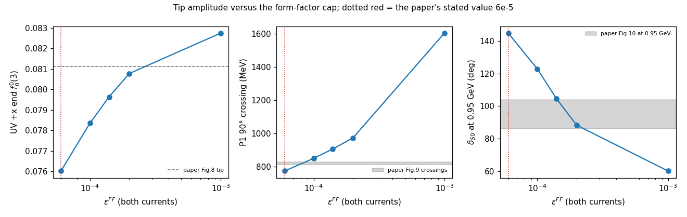
*Tip amplitude against eps_FF (both currents); grey bands are the paper's values, the dotted line its stated 6e-5.*

## 7. A request

It would help us a great deal to see the code or notebooks behind the 2309 runs, in particular the parts that implement (3.73) and (3.75) -- how the caps on F0 and F1 above s0 were normalised -- and the saturation iteration with the way the three points of Figs. 9 and 10 were selected. With that we could tell which of the readings above you used and settle the remaining differences; we are happy to share any of our solutions and the full log of our runs in return.
