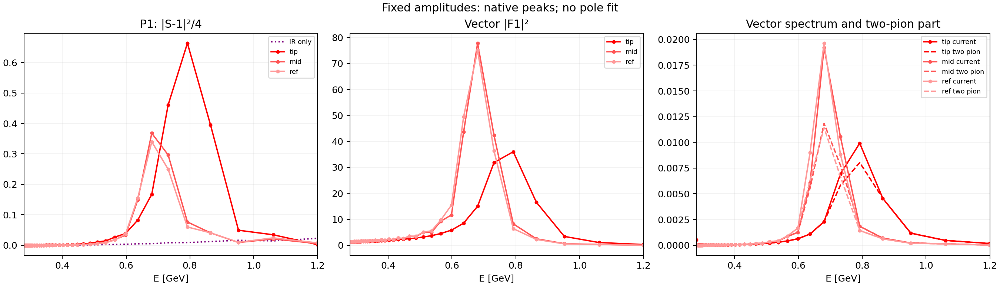

# 从 IR/UV 约束到 ρ：专家反馈后的主线审计

日期：2026-09-10。对象：当前实现（起始十模块，本轮按职责拆为十二模块）、专家报告 C3/Fig.7 所在节，以及 2309.12402v3 的散射—电流—QCD 机制。没有使用子代理，没有重新选择代表点，也没有输入 ρ 质量或拟合实验相位。

## 1. 本轮实质结果

Fig.7 必须继续作为仅 IR 的对照。论文 §4.2 就用它展示 P1 的不足，§4.3/Fig.9 才加入 UV。此前展示链有一个实际缺口：`gauge-phases` 硬编码旧 C 目录，手征范数不匹配时静默省略 IR 曲线。本轮改成显式 `--baseline-profile`，检查同一散射设置、手征范数和容差，接入当前冻结的 C2/C3 振幅。

本轮没有重新优化 C/E 振幅，补算了此前缺少的散射强度、形状因子与电流谱诊断。三种量共同出现峰，比仅报告相位越过 90° 更直接地展示机制。

| 冻结振幅 | P1 的 90° 线性读数 / MeV | 散射强度主峰所在原生节点 / MeV | 峰高 \(|S-1|^2/4\) | \(|F_1|^2\) 主峰所在节点 / MeV |
|---|---:|---:|---:|---:|
| C，仅 IR | 无 | 全段最大值在末端 1199.42 | 0.0225161 | 未引入电流 |
| E tip | 788.621 | 792.136 | 0.663614 | 792.136 |
| E mid | 700.403 | 680.414 | 0.367914 | 680.414 |
| E ref | 696.267 | 680.414 | 0.339725 | 680.414 |

电流谱与两 pion 部分的主峰也分别落在 792.136、680.414、680.414 MeV 的节点。所有局部极大值（包括小的阈值振荡）都保存在 JSON，没有平滑或按质量窗口筛选。C 有一个很弱的局部起伏，不能把“没有目标 ρ 共振”写成“完全没有任何局部极大”。

数据：[完整相位与谱](CE_spectra_final/phases.json)、[谱图 PDF](CE_spectra_final/rho_mechanism.pdf)、[修正后的 Fig.9](CE_spectra_final/fig9.pdf)。节点峰位不是连续峰位区间，也不是第二张黎曼面极点质量。

更强的新增证据是固定振幅的排除实验：**保持 Fig.7 的全部 3876 个系数逐项不变，允许全部电流自由度变化，原式对偶给出严格负的零目标上界约 −9.09881296。该振幅无法扩展成满足当前 UV 输入的联合解。** [生产证书](C_fixed_current_fiber_03/report.json)，另有 [768-bit 独立重验](C_fixed_current_final/report.json)。这是“当前无目标 ρ 的 IR 代表振幅被 UV 排除”的有限模型结论，不能推广为“所有无 ρ 的振幅均被排除”。

## 2. 从完整幺正性到电流谱的精确代价

约定始终为

\[
f^I_\ell(s)=\frac14\int_{-1}^{1}P_\ell(\mu)T^I(s,t,u)\,d\mu,
\qquad S=1+i\kappa f,\quad\kappa=\pi\sqrt{1-4/s}.
\]

完整 S 矩阵幺正、投影到两 pion 态后得到 \(|S|\le1\)，并非要求所有能量都弹性。定义 \(\Delta=1-|S|^2\)，则

\[
\Delta=\kappa(2\operatorname{Im}f-\kappa|f|^2)\ge0.
\]

电流与同一 S 连接。令 \(\mathcal F=kF\)、\(R=\rho_{\rm current}\)，原约束是

\[
G=\begin{pmatrix}1&S&\mathcal F\\S^*&1&\mathcal F^*\\
\mathcal F^*&\mathcal F&R\end{pmatrix}\succeq0.
\]

当 \(\Delta>0\) 时，上方 2×2 块正定。直接做 Schur 补，得到必要且充分的条件

\[
\boxed{R\ge R_{\min}=|\mathcal F|^2+
\frac{|\mathcal F-S\mathcal F^*|^2}{1-|S|^2}.}
\tag{1}
\]

这里不是添加正则化。式 (1) 与原 Gram 完全等价。第一项是两 pion 谱；第二项是保持该 S 和 F 时不可避免的额外谱代价。其差就是 Schur 剩余量。直接行列式核对为

\[
\det G=\Delta(R-|\mathcal F|^2)-|\mathcal F-S\mathcal F^*|^2.
\tag{2}
\]

边界必须单独处理：\(|S|=1\) 时，有有限 R 的充要条件是 \(\mathcal F=S\mathcal F^*\) 且 \(R\ge|\mathcal F|^2\)。F=0 时不定义 F/F*；约束退化为散射盘与 R≥0。严格谱饱和 R=|\(\mathcal F\)|²、F≠0 会同时强制弹性和 Watson 关系；仅有 η=1 则不强制谱完全饱和。

若 F≠0，写 \(Q=F/F^*\)、\(r=|\mathcal F|^2/R\)，有

\[
|S-Q|^2\le(1-\eta^2)(r^{-1}-1),
\]
\[
4\eta\sin^2(\delta-\arg F)
\le(1-\eta^2)(r^{-1}-1)-(1-\eta)^2.
\tag{3}
\]

因此 η 接近 1 本身不够；r 很小时，Watson 相位误差仍可很大。η=0 时散射相位没有定义，不能用 90° 上穿孤立判定共振。

程序把式 (1) 的直接除法限定在 Δ 相对于浮点舍入已分辨的节点；其余明确记录 `null`。行列式表达式、原式 Arb 可行性与显示诊断分别保留，不截断 η，也不加 π 修饰曲线。

## 3. UV 如何通过谱预算传递到 P1

在同一原生网格上，\(F(0)=1\)、\(\operatorname{Re}F=1+K\operatorname{Im}F\)。运动学因子为

\[
k_0^2=\frac{3\sqrt{1-4/s}}{256\pi^5},\qquad
k_1^2=\frac{(s-4)\sqrt{1-4/s}}{384\pi^5}.
\]

固定 mπ=140 MeV、√s₀=1.2 GeV、Nc=3、Nf=2、αs=.4；手征球为合并八维 L2、εχ=.002。四个 FESR 使用论文打印中心值、以 pion 单位计量的 raw 独立绝对误差 .002，以及原生节点 s≤s₀ 上的统一 π/M 权重。高能约束为 \(|\mathcal F_0|^2\le2m_q^2\epsilon^{FF}\)、\(|\mathcal F_1|^2\le\epsilon^{FF}/2\)，εFF=6×10⁻⁵，mq 使用已声明的算术平均。没有换成相对误差或归一化误差。

单位换算明确为：物理标量/矢量电流谱分别除以 \(m_\pi^4\)、\(m_\pi^2\)，四个 raw 矩依次除以 \(m_\pi^{6,8,2,4}\)；标量 F₀ 除以 \(m_\pi^2\)，矢量 F₁ 不变。这与 F₀(0)=F₁(0)=1 的当前无量纲归一化一致。

对每个正权矩，把 (1) 逐节点相加：

\[
\sum_j w_jR_j=
\underbrace{\sum_jw_j|\mathcal F_j|^2}_{\text{两 pion}}
+\underbrace{\sum_jw_j\frac{|\mathcal F_j-S_j\mathcal F_j^*|^2}{\Delta_j}}_{\text{相位失配代价}}
+\underbrace{\sum_jw_j(R_j-R_{\min,j})}_{\ge0}.
\tag{4}
\]

F(0)=1 阻止把 F 整体缩成零；解析 Hilbert 关系联系各能量；高能 FF 界抑制高能两 pion 强度；FESR 限制总谱预算；Gram 把谱预算与同一散射振幅联系。为节省预算，优化可以发展 F 的中间能区增强，并改变 S 来减小失配。这是 UV 影响介子谱的明确数学通道；不是通过在优化目标中加入目标共振。

新诊断给出的 P1 零阶 raw 谱矩分解为：

| 振幅 | 总谱矩 | 两 pion 部分 | 相位失配代价 | Schur 剩余量（差值） |
|---|---:|---:|---:|---:|
| tip | .1477107850 | .1330201449 | .0146725714 | 约 1.81×10⁻⁵ |
| mid | .1477110982 | .1105805314 | .0371259073 | 约 4.66×10⁻⁶ |
| ref | .1477110946 | .1044942290 | .0432120464 | 约 4.82×10⁻⁶ |

上限为 .1477112070。三点都接近这一上限；失配代价约占 9.93%、25.13%、29.25%。**接近 Gram 行列式饱和，不能被误读为两 pion 谱饱和。** 在三个谱主峰节点，两 pion 份额分别约 .810、.616、.581。mid/ref 的形状和质量差异确实伴随明显的未饱和现象，但这还不足以证明它是全部差异的唯一来源。

## 4. 为何不能从两条求和规则直接宣布唯一的 ρ

P1 的两个矩满足

\[
M_{-1}=\int R(s)\frac{ds}{s},\quad M_0=\int R(s)ds,
\qquad \frac{M_0}{M_{-1}}=\mathbb E_{R(s)ds/s}[s].
\]

中心值给出的有效平均能标约 822 MeV；保留当前 raw 误差后，两个矩单独容许的该平均能标范围约为 673–1140 MeV。它是加权平均值的范围，不是 ρ 质量置信区间。只有另加“单个窄峰饱和”等假设，才能把比值近似当成质量平方；本轮没有加入这种假设。

相同两矩可由窄峰、宽峰或多峰产生。形状因子解析性也不能仅凭两矩就消除这一自由度。连续情形下，即使知道完整边界模长，内外因子分解中的零点/Blaschke 因子仍须交代；F(0)=1 并不提供全部零点位置。在弹性区可用 Omnès 形式解释相位与 F 的关联，但需说明零点、多项式、非弹性区和高能相位。当前 PV 散射处方只有原生物理节点，不能借 FF 的解析表示补造 S 的连续绕行或第二张面极点。

所以本轮有三个不同层次的结论：约束间的传递机制有精确公式；固定 C 振幅被原 UV 条件排除有证书；三个预选 E 振幅的共振式谱增强有实际数据。全可行集内共振的必然性、唯一极点、宽度和全部分辨率稳定性尚未证明。

## 5. 密度正则化：有限模型的充分结论

令 r 为实际双谱密度的独立条目，包含全部 ρ₁ 和 ρ₂ 的上三角。ρ₂ 的非对角存储是 C_flat=2ρ₂，故 L4 计算时必须除以 2。固定

\[
\|r\|_4\le B,\qquad B(M)=100\left[M^2+\frac{M(M+1)}2\right].
\]

M50 的 B=377500。它不限制电流谱 R，也不直接约束 T₀ 或单谱 σ。下面给出为何它足以使**当前有限散射可行集**紧的证明，不依赖整个 H 满列秩，也不借用 sine 的秩证明。

对每个原生节点，直接从同位旋和角积分得到

\[
u_{0i}=\operatorname{Im}f^0_0(s_i)=\tfrac32\sigma_{1i}+\sigma_{2i}+D_{0i}r,
\qquad u_{2i}=\operatorname{Im}f^2_0(s_i)=\sigma_{2i}+D_{2i}r.
\]

幺正盘给 \(0\le u_{0i},u_{2i}\le2/\kappa_i\)。Hölder 不等式随即给出

\[
|\sigma_{2i}|\le\frac2{\kappa_i}+B\|D_{2i}\|_{4/3},
\]
\[
|\sigma_{1i}|\le\frac4{3\kappa_i}+\frac{2B}3\|D_{0i}-D_{2i}\|_{4/3}.
\tag{5}
\]

再取任一 S0 原生实部行：\(\operatorname{Re}f^0_0=\tfrac52 T_0+a\cdot\sigma+Dr\)。由于 \(|\operatorname{Re}f|\le1/\kappa\)，有

\[
|T_0|\le\frac25\left[\frac1\kappa+\sum_j|a_j|\,\overline\sigma_j+B\|D\|_{4/3}\right].
\tag{6}
\]

固定有限 M 时每个 κᵢ>0，所有矩阵元有限。式 (5)–(6) 连同密度球控制所有 3876 个系数。约束闭且非空（零振幅可行），所以有限散射可行集紧，任何连续线性支持目标都取得最大值。不需要把自由 T₀ 设为零。L4 是一种足够的有限正则化，不是由 QCD 唯一决定的范数或 B。

对偶中的密度项恰为 \(B\|r_{\rm dual}\|_{4/3}\)。一份已经通过的固定对偶也给出改变 B 时的条件上界

\[
U(B')=U(B)+(B'-B)\|r_{\rm dual}\|_{4/3}.
\tag{7}
\]

B′≥B 时旧可行振幅仍提供下界。这是无需参数扫描的支持敏感度界；它不控制同一投影后完整振幅或相移的变化。现有 tip/mid/ref 的密度范数约为 376074、375902、375781，都接近 377500，不能据此声称正则化已可忽略，也不能用投影 gap 代替相移误差。

这不是连续极限定理。若换成平均 L4，当前阈值是 B/Nρ^(1/4)=100Nρ^(3/4)，随 M 增长；κ 最小值也趋于零。没有得到统一的连续密度界或无限自旋控制。原生 PV 值与有理离切线表达式并非已经指定同一完整解析函数，故以上结论严格停留在该有限模型。

## 6. 联合问题的高能自由谱：必须说明的边界

低能谱变量因正 FESR 权重而有上界；低能 F 因 R≥|\(\mathcal F\)|² 有界，高能 F 因 FF 上限有界。因此 C、ImF 和有矩约束的谱变量构成有界的有限变量组。

高能 R 未被 FESR 截止以下的积分约束，不存在自动的全局上界。不能因此直接宣称整个 4076 维联合可行集紧。对高能节点，Δ>0 时可以按 (1) 补出有限 R；Δ=0 时还需 Watson 范围条件。把高能谱消去后，仅保留散射盘与 FF 界得到的集合，可能含有不能用有限 R 实现的边界极限。

例如 S→1、F 为固定非零纯虚数时，所需 R_min 发散，极限 S=1 不满足范围条件。一般而言，投影可非闭。若存在同约束下高能散射盘严格内点，则对消去后的任一点与该内点作凸混合，可获得 Δ>0 的点，并逐点补出高能 R；因此该紧松弛集合与原投影的闭包相同，线性支持的上确界一致，但不保证原完整变量中最大值必定取得。

当前 `JointProblem` 消去无矩上界的高能谱、`joint_audit` 补回并验全部原 Gram，正对应这一有限内点构造。接受一个完整点仍必须通过原式；不能把边界闭包中的形式解当成已实现的联合振幅。这个结论解释了数值过程，不增添高能谱截断，也不放宽基本幺正性。

## 7. 固定 C 振幅的原式排除实验与数值修正

实验只开放 100 个 ImF 与 100 个电流谱变量；14 个无矩上界的高能谱可在严格盘内补回，实际锥求解变量是 186。不是在一个任意小振幅子空间中寻找完整 QCD 解，而是回答指定 C 振幅是否存在任何当前变量扩展。

早期正上界验回记录完整保留：首次为约 123.048，原 H 精确乘积修正后为约 355.648；进一步收紧 ImF 残差界、改善 PSD 对偶修复仍未改变这一判定。它们都没有当作不可行证明。

最终修正是精确代入已固定的振幅：先用 Arb 对原 H 与 C 相乘，再构造同一 S 的电流常数块；把唯一的混合权重 λ=1 从锥变量中消去。之前保留 λ=1 等式会让其数值残差进入接近弹性的 Gram。消去后的问题在数学上完全相同，避免了这类无意义的数值自由度。没有固定或删除本应变化的形状因子/谱变量。

最后仍由独立 `joint_audit` 使用原 H/K/k、四矩及 FF 上限核验对偶。其结构是

\[
0\le c_{\rm dual}+a_{\rm dual}\cdot C+
\sup_{v,R}\{r_v\cdot v+r_R\cdot R\}=:U_C.
\]

半正定对偶逐个用 Arb 主子式确认；所有站立性残差有显式支持上界。最终 U_C<−9.0988，与可行时 0≤U_C 矛盾。对偶射线可以正数缩放，−9.0988 不是物理距离、显著性或质量误差。

新增的 ImF 残差界也有直接推导。取正对角 D，使低能的 \(\sum d_j|F_j|^2\le1\) 来自一个正 FESR 上限，高能每项由 FF cap 给出，总和≤2。令 C_K=KᵀDK+D，则三角不等式和 Cauchy–Schwarz 给

\[
|r_v\cdot v|\le(\sqrt2+\sqrt{\operatorname{tr}D})
\sqrt{r_v^T C_K^{-1}r_v}.
\tag{8}
\]

它只用于原式对偶残差验回，取其与原坐标盒界中较好的合法上界。PSD 对偶修复改在各对角尺度归一化后估计修正，最后仍核验实际修复矩阵。两项改善都不改变物理集合；本次真正使固定 C 证书闭合的是 λ 的精确消去，不能把其它尝试包装成成功原因。

## 8. 实现、验证和后续物理决策

按用户本轮补充，模块数不再是十个的硬限制。实现按科学职责拆为十二个模块：新增 spectra 集中谱诊断，certificates 集中原式联合证书。各文件仍≤350行、≤24KiB；测试仍为三个文件，没有实验专用计算入口。物理算子、选点、全系数、FESR 和 FF 输入不变。UV 配置自身验证，序列化工具归入公共记录，线性残差归入求解器；显示与因果检查继续走原 CLI。旧公开小接口保留兼容导出。原始算子与旧生产字节完整保留。

新增独立测试覆盖复 Hermitian Schur 补、弹性退化/违规输入、多个离散极大值、精确椭球支持比较、相差多量级的 PSD 对偶修复，以及一个“完整联合模型可行，但指定振幅被排除”的可解小模型。原有角积分、归一化、完整变量、原式支持和 Newton 导数检查继续运行。最终验证摘要见 [verification.json](verification.json)。

本轮完成的是 A1/A2 正则化与机制推导、C3→D 的因果排除证据、E3 的谱峰和预算诊断、F3 的对应数据交付。没有把 B3 全区域、E 三点定量稳健性或 F 的 L12 缺项标成完成。

下一物理决策是：区分“同一支持面允许的相位/谱变化”与“分辨率变化”。已有三点都相当靠近密度界、mid/ref 的谱未饱和明显，而当前 raw 第一 P1 矩误差又较宽；这些是需要原样报告的因素。若进一步约束代表振幅的唯一性，应预先固定同一近支持截面并求可观测量范围；不能仅凭支持 gap 推断相位精度。F 仍需原声明的 L12 联合见证与支持；不以四配置或一个漂亮的 tip 替代它。精确连续极点的提取则需要额外指定可用的解析振幅族，不能靠曲线连线补出来。

## 来源与重放

- [2309.12402v3 原文](https://arxiv.org/html/2309.12402v3)：§2.1、§2.3、§3、§4.2–4.3；本地 PDF 与 TeX 同版本。上面的紧性、投影闭包和残差界是本轮推导，未冒充原文定理。
- [专家报告](../../reports/expert_review_20260910/He_Kruczenski_2309v3_Expert_Review_ZH.pdf)：C3/Fig7、E3、Gram/谱饱和、未闭合项。
- [预声明与输入哈希](AUDIT_PLAN.json)、[修改前源码与测试](before_source.json.gz)、各运行 `source.json`、`report.json`、`joint.npz` 和 `joint_audit.json`。
- 统一入口：`python -m smatrix_bootstrap.run gauge-phases --baseline-profile ...`；固定振幅测试：`boundary --mode gauge --joint-feasibility --fixed-amplitude --direction 0 0`；原式重验：同参数 `dual --bits 768`。完整命令在各 `report.json` 的 `parameters` 中。
