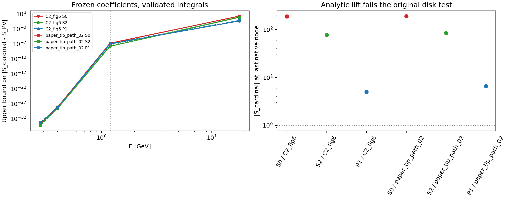

# 2309.12402v3：逐部分对齐与底层原型复审

2026-09-10。此轮从论文定义重新推导，复用冻结振幅与原始算子作有界检验。没有重新优化振幅、拟合相移、扫描物理参数或调用子代理。完整证明在 [FOUNDATIONS_PROOFS](../../evidence/FOUNDATIONS_PROOFS_20260910.md)，机器可读的逐 claim 记录在 [CLAIM_LEDGER.json](CLAIM_LEDGER.json)。

## 1. 最重要的结论

**当前存在已证明的解析重建差异，不能把“全部核心 claim 已完整证明”作为本轮结论。** 部分 claim 本来只是论文的数值观察；部分有条件成立；“现有原生值和整个离切线函数来自同一个精确解析振幅”则有明确的数学障碍。为这些不成立或证据不足的强命题补造证明，恰好会违背此次从底层出发的要求。

代码审查未发现把770MeV作为优化输入或手工改相位来匹配数据；已确认的输出辅助选择是历史χ范数来源及旧ref/mid标记坐标。

本轮完成了三件实质工作：给出共同解析重建障碍的精确公式和实际振幅证据；补齐可成立结论的完整条件证明；修复参考输出参与选点、证书前提未检查以及区间/零点处理中的实现问题。旧有限矩阵证书经复核仍有效，其范围没有升级成完整 QCD 结论。

## 2. 底层差异不是角积分算错，也不是末位精度

现有 PV 原型：物理节点使用离散 Hilbert 核 K+iI；离切线使用中点有理 Cauchy 核。对于节点密度的正弦系数 aₙ，前者对应

\[
P_M(z)=\sum_{n=1}^M a_nz^n,
\]

而后者精确等于

\[
R_M(z)=\frac{\sum_{n<M}a_n(z^n+z^{2M-n})+2a_Mz^M}{1+z^{2M}}.
\]

两者一般不等。更强的是，现有离切线部分波的解析延拓满足

\[
\operatorname{Res}_{s=s_i}f_R(s)=-w_i\operatorname{Im}f_{PV}(s_i).
\]

非零虚部对应非零极点，不能同时等于程序给出的有限节点值。此结论针对既定的整个离切线函数；若允许换插值族，只保留有限采样数据，则是否另有解析完成是另一问题。

本轮重新构造了与该 Hilbert 核一致的最小次数解析完成，保留全部3876系数，并用有理圆参数化进行 Arb 严格角积分。比较的是相同完整系数，没有删变量或改变相位分支。

| 冻结向量 | 在1.199424GeV：三主波最大 $\lvert\delta S\rvert$ | 在17.826087GeV：解析完成的η，S0/S2/P1 |
|---|---:|---|
| C2/Fig.7 IR | 1.655×10⁻⁷ | 189.41 / 77.45 / 5.070 |
| E tip | 1.731×10⁻⁷ | 191.23 / 85.43 / 6.611 |

24项 PV 独立角积分均与原闭式投影包络相交；两个向量的24项离切线延拓留数均严格非零。因此不能把高能差异归因于一个未核对的投影符号或四舍五入。

图中的连线只连接四个预定检查点。它不是 PV 离节点相移曲线。

进一步从完整系数和核差推得**整个4<s≤s₀范围**的保守误差界：

| 向量 | S0 的 $\lvert\delta S\rvert$ 上界 | S2 上界 | P1 上界 |
|---|---:|---:|---:|
| C2 | 2.539×10⁻⁵ | 1.088×10⁻⁵ | 7.601×10⁻⁶ |
| tip | 3.130×10⁻⁵ | 1.129×10⁻⁵ | 9.050×10⁻⁶ |

这说明旧低能曲线的特征不只是绘图连线制造的，但**不能把低能求值接近推成优化可行域接近**：高能约束恰好参与了振幅的选择，而解析完成在这些节点被排除。

最高节点随M增长如 $s_{\max}\sim64M^2/\pi^2$。在那里 $|z(4-s_{\max})|^M\to e^{-\pi/2}$，Nyquist 混叠差不随M统一消失。离散L4界没有提供排除这类高频行为的假设。有限M/L图看似稳定不能替代这一缺失的误差论证。

数据与严格积分来源：[原始比较](analytic_comparison/analytic_audit.json)、[统一界及留数](verified_analytic_audit/analytic_audit.json)。

## 3. 输入层的对齐与未解问题

散射同位旋、8π²归一化、κ、M/L计数、实际ρ₂非对角除2、电流相空间因子、Gram共轭、FESR的π权以及平方FF界，都有独立推导与实现检查。L=10确实是每个同位旋十个波，不是最大角动量10。

但下列输入不能假称已经从理论唯一推出：

| 项目 | 本轮审查 |
|---|---|
| χ 范数 | 2309写“某种范数”；combined-L2的历史选择确实使用了原Fig.5残差及后续代码，不能改写成自始独立的推导。两种L2集合的包含关系可证明，哪个是唯一原设置不能证明。 |
| E 选点 | 历史ref/mid使用了Fig.8输出标记坐标。固定在相位之前只避免相位择优，仍是参考输出参与设置。新选择接口已禁止该路径。 |
| 夸克质量 | 共同平均质量代入Eq2.50，两个标量矩比打印目标低约8.48%。RMS约低.68%，但需改变/解释标量电流；不能因为数字更接近就采用。 |
| GMOR | 给定中心值的 $-\langle j_S\rangle/(m_\pi^2f_\pi^2)=.6027931$。凝聚中心值对应71.43MeV，而非92MeV。它们可以作为不同近似输入使用，不能声称精确LO自洽。 |
| SR误差 | raw .002是声明的数值窗口，未由被遗漏OPE项或duality误差严格推出。标量一阶矩约8.5%的中心差并不被原.002窗口覆盖。 |
| FF渐近 | 有限高能cap不是 $F\to0$ 的证明。tip的最小次数FF完成在无穷远约为 .06813/.01858。 |
| 正则化 | B=100Nρ足以控制当前有限散射坐标，不是QCD唯一规定，也未证明对相位无影响。 |

以上差异全部保留。没有修改凝聚、质量、s₀、范数或FF阈值来让曲线更像论文。

## 4. A1–F3 全部核心 claim 的判定

“有限已证”只针对明确给定的矩阵问题；“观察”不等于对全可行集的定理。

| 步骤 | 成立的论证/证据 | 不能升级的结论 |
|---|---|---|
| A1 | 交叉/同位旋代数、完整参数计数已证；混合核的精确关系及留数障碍已证 | 当前完整离切线函数与原生值是同一个精确解析振幅 |
| A2 | 树级手征投影、电流归一化、FESR变换及单位已推导 | 唯一χ/B/mq/SR处方；全部输入严格QCD自洽 |
| A3 | 24项独立严格PV角积分；一致解析完成及统一低能核差界 | 全能量/全自旋幺正；所有离散误差已经消除 |
| B1 | 原式弱对偶、自由列消元、L4支持与有限紧性已证，verifier新增前提检查 | 任意H都能套用同一消元式；对无限物理模型的严格界 |
| B2 | 既有38份有限支持与.00967577几何预算 | 原图/原作者可行集完全同一 |
| B3 | 同范数ε嵌套定理、部分包含/排除和严格右端缩小 | 六个区域全部达到.01；ε=.001公式点已判定 |
| C1 | 81点线性改善观察；本轮严格证明橙/绿变号区间内有零点 | 蓝色全区间无零点；采样误差等于连续误差 |
| C2 | C1→C2→C3完整向量身份保留 | 未指定一致重建时的完整解析振幅身份 |
| C3 | 冻结IR点的P1不足、S0/S2低能形态有数据 | 所有IR可行振幅都不含ρ；由四点χ严格推出全部相移 |
| D1 | 复Gram与实锥等价；Schur条件及退化面充要条件已证 | Gram是完整QCD的充分条件；PSD必定弹性 |
| D2 | 四个有限矩、FF平方界实现；独立输入审计完成 | 两矩必定产生峰；数值误差窗是严格OPE误差条 |
| D3 | 4076维完整联合有限见证仍有效 | 受限初始化已优化全空间；已构造全局QCD解 |
| E1 | UV包含IR及严格缩小的有限证据 | 原图约5.35的强非对称已经复现；当前比值只在约[.9554,1.1804] |
| E2 | 旧三点有限支持完成；新接口使用源图无关几何规则 | 旧参考标记选点是独立预测；全部振幅唯一 |
| E3 | 三点ρ式峰、Gram预算、固定C的UV排除证书 | 唯一极点/宽度；三点定量稳健性全部符合论文 |
| F1 | 四组已验；新增L条件必须重验 | 缺L12时五组完成；τ>0就是不可行证明 |
| F2 | 四组分辨率差异有数据 | 有限组曲线稳定就是连续收敛定理 |
| F3 | 本轮补足证明、反例、源码和逐claim台账 | 全部Fig.3–11及物理claim已完成 |

本轮严格零点符号为：橙色 f₀⁰(.3)<0、f₀⁰(.35)>0；绿色 f₀⁰(.4)<0、f₀⁰(.45)>0。由离切线函数在对应区间连续，介值定理保证零点存在。没有把这个存在性论证冒充唯一性或蓝色无零点证明。

固定C的UV排除界仍约−9.09881296；原tip原式支持仍达标。这两项重验说明旧有限证据没有被本轮架构反例整体抹掉。

## 5. 已落实的实现修正

1. 新增 `analytic.py`：从离散正弦正交性、Cauchy积分和圆参数化重新构造数学对象，作严格比较。未恢复退休源码，未把旧sine证书转移到PV。
2. `select-gauge` 拒绝用论文输出标记作为科学选点输入。旧选择和数据原样保留，历史输出辅助性质明确标注。
3. 优化/区域操作必须显式声明 χ 范数，取消隐含的答案辅助默认值。原combined结果仍只代表该声明集合。
4. 原式证书现在先检查其自由列消元恒等式。新增反例是一个真正无界的自由目标，不能再被误报为有限界。
5. `evaluate` 保存完整f的精确球编码，浮点裕量端点向外舍入。S=0或非有限时不伪造相位；F=0节点继续参与谱和矩预算，只从需要F/F*的诊断中分开处理。

现为13个按科学职责组织的模块、仍为三个测试文件。没有为增加数量而添加同类测试；本轮新增四项独立检查，最终结果见 [verification.json](verification.json)。

## 6. 下一步必须回答的物理决策

首先明确要复现的是声明的有限近似，还是一个具有完整解析函数的有限参数族。若要后者，必须统一直接道与交叉道的核，再求新的完整联合见证；原PV可行性不能继承。解析尾部、T₀与FF无穷远条件应由所选函数族推出后才施加，不能向PV随意搬运，也不能只把旧T₀改成零就宣称修好——P1本来不含常数T₀，其高能反例仍在。

新输入协议必须先说明：采用打印矩还是Eq2.50、标量电流与质量规则、GMOR作为关系还是带误差输入、χ范数和B、端点求积及理论误差范围。图形输出不能参与选择。可行性成立后再按独立几何目标求支持，固定完整向量后才看相位，最后完成原五组M/L比较。

本轮没有以一个小模型替代论文结果，也没有把“再加采样/再跑迭代”写成充分修复。当前已证结构障碍、未公开处方和未完成的数值任务必须分别处理。

## 来源与重放

- 原文：[2309.12402v3](https://arxiv.org/html/2309.12402v3)，本地43页PDF与TeX；本轮参考的是公式与假设，不把原图数值当新输入。
- 上轮专家报告与[上一轮机制审计](../expert_response_20260910/RHO_MECHANISM_AUDIT_ZH.md)均保留；其有限证书范围继续有效。
- [预声明](AUDIT_PLAN.json)、[完整严格比较及输入审计](verified_analytic_audit/analytic_audit.json)、[橙色零点](C1_orange_root/evaluation.json)、[绿色零点](C1_green_root/evaluation.json)。
- [有限tip重验](finite_tip_recheck/report.json)、[固定C排除重验](finite_C_exclusion_recheck/report.json)。
- 统一入口：`python -m smatrix_bootstrap.run analytic-audit`。使用 `--comparison-manifest` 时复用已经验证的角积分，只补代数误差界/输入审计；全部参数与producer在各运行报告中。
