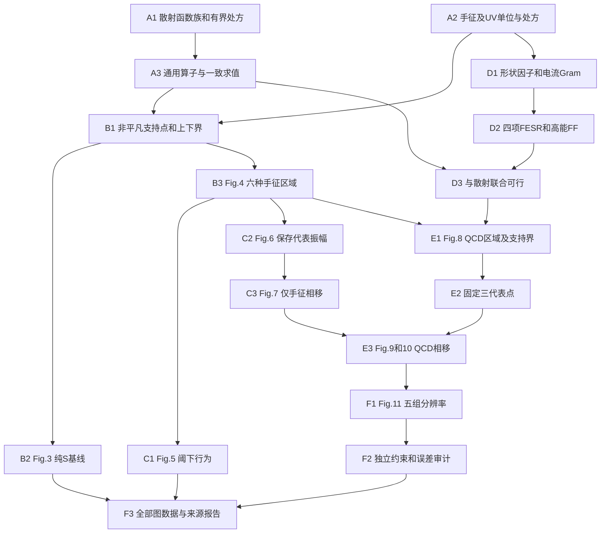

# 2309.12402v3：从物理主线到可验收的实现

最新执行合同：[combined-l2 + hard-midpoint](../../../results/runs/mainline_alignment_20260909/PAPER_MAINLINE.json)。χ分组由原Fig.5三色残差指纹及作者后续代码共同支持；B/C正在重新验算，D新联合见证已通过，E/F新主线未完成。CLI默认χ范数已改为combined；历史separate复放须显式指定。后文旧阶段交付作为历史对照。

当前更新：按[Eq3.72截止决策](../../../results/runs/mainline_alignment_20260909/CUTOFF_DECISION_ZH.md)，D–F正在以原文统一π/M的`hard-midpoint`重新执行；A–C沿用。新D已完整通过，E支持正在求解，不能把旧clipped的E/F完成状态转移过来。新输入与相位之前固定的选点见[HARD_MAINLINE](../../../results/runs/mainline_alignment_20260909/HARD_MAINLINE.json)。以下阶段交付中的clipped结果按历史变体读取，当前进度以STATUS为准。

更新：2026-09-09。[STATUS](../../../STATUS.md)是唯一进度表，[SCIENCE](../../../SCIENCE.md)保存公式与来源。**A–F有限计算链已有交付；核心claims仍有未闭合的物理形态和稳健性，不只是逐点定量误差。** 最新[18步骤审计与对齐](../../../results/runs/claims_alignment_20260909/CLAIMS_ZH.md)及[48组曲线比较](../../../results/runs/claims_alignment_20260909/CURVE_COMPARISON_ZH.md)优先于旧阶段完成口径。 见[F交付](../../../results/runs/stage_F_mainline_20260909/F_RESULT_ZH.md)。 见[C交付](../../../results/runs/stage_C_mainline_20260908/C_RESULT_ZH.md)及[D交付](../../../results/runs/stage_D_mainline_20260908/D_RESULT_ZH.md)。不要求每个原图点完全一致，不调参贴图；保留既有差异与失败，不把它们变成无期限的前置任务。

本次[B1方法审计](../../../results/runs/stage_B1_source_method_audit_20260907/OUR_METHOD_REVIEW_ZH.md)修正了推进口径：先完成论文公开有限设置及其IR→UV→相移的完整原型，再按原附录做分辨率比较；本项目额外的T0zero、五尾、global FG和超密网格明确作为加强分支。所有已知违例保留并按论文能区／主波／量级报告，但无限域认证不再作为全部D阶段的前置门槛。有限支持闭合不自动代表物理审核通过，两项状态必须同时展示。

## 1. 论文真正要回答什么

目标是把高能处的夸克／胶子信息与低能处的 pion 信息结合，约束中间能区的 pion 散射。论文用 Nc=3、Nf=2 的例子检验这种方法。它的关键结果是一组连续的比较：基本散射条件允许很多振幅；手征关系把区域压成很窄的一条，并能较好解释 S0/S2；P1 仍不合理；加入电流、形状因子和 QCD 求和规则后，P1 才出现较合理的 rho 共振。这种“加入哪类物理信息，改善哪一部分结果”的因果比较，比单独画出一条像实验的曲线更重要。

S0、S2 的角动量都为0，同位旋分别为0、2；P1 的角动量和同位旋都为1。分波 S=eta exp(2i delta)，delta 是相移，eta 表示留在弹性通道中的程度；模型约束 eta≤1，未强制 eta=1。允许非弹性过程不违反总概率守恒。

幺正性在这里有明确的可计算标准。论文第9页(2.9–12)给出 \(S=1+i\kappa f\)、\(\kappa=\pi\sqrt{1-4/s}\)，所以应逐波检查

\[
1-|S|^2=\kappa(2\operatorname{Im}f-\kappa|f|^2)\ge0.
\]

它等价于第24页(3.71)的散射2×2矩阵 \(\begin{pmatrix}1&S\\S^*&1\end{pmatrix}\) 半正定；只检查 Im f≥0 会漏掉真实违例。精确阈值s=4处，若f有限则S=1、裕量为0；阈下的振幅用于手征约束，不用上述物理幺正disk检验。共用`unitarity_margin/scattering_gram`及弹性、非弹性、违例解析测试固定了这一归一化。

判据正确与覆盖完整是两件事。计算器可以在所列能量和分波上报告通过、违例或无法判定；50点或150点都没有检查所有能量，增加几个高分波也没有覆盖无限尾部。sine的Arb角积分尚未包含严格积分余项包络；PV则采用声明的有限节点程序。物理主张须结合对应能区／分波的偏离量级、稳定性和已知违例审查，有限程序通过不等于连续认证。

区域图横轴 x=f00(3)、纵轴 y=f11(3)。s 是以 pion 质量为单位的能量平方；物理阈值在4，所以3是解析延拓的坐标，并非一次真实碰撞。图上的一点仅提供两个数，不能代替完整振幅；不同振幅可能投到同一点，即使在边界也没有唯一性的证明。相移必须由保存的完整解恢复。

[Snowmass 白皮书](../../../references/2203.02421v2.pdf)提供方法背景，不是与本论文并列的第二套交付。标量值2.6613是方法校准参考，既不约束 QCD 电流，也不代表已经复现了 pion 区域的一部分。

## 2. 本轮 review 修正了哪些方向

| 旧理解或容易产生的误读 | 修正后的工作原则 |
|---|---|
| 代码已很完整，只剩求解器继续运行 | B区域、C/E相移、D联合模型和F五组分辨率已实际计算；原型交付仍与原图定量吻合分开 |
| 命令名称已能保证pure/chiral设置正确 | `mode`、`prescription`、`unitarity-scope`及常数条件共同定义问题；旧PV `support`脚本已退休，当前PV处方通过统一CLI执行 |
| 找回密度正则化就解决了所有来源问题 | 还需明确散射插值／减除／无穷远条件、手征范数、FESR 容差尺度和截止积分、m_q 规则 |
| 使用同样50个节点，就恢复了作者的散射实现 | 现已逐项映射后续作者的PV/Legendre-Q节点算子；它与finite-sine交叉积分不同，也不证明v3原图使用了相同范数和正则化 |
| 电流 witness 已通过，所以加入 gauge 应当可行 | 历史 witness 对特定 raw-moment/hard-mask 处方成立，未实现当前受密度界限制的共同散射振幅 |
| 完整 Fig.3 是 QCD 模块的串行前提 | 原文 §4.1 明说纯 S 图后续不再使用。它仍是基线交付，但可与手征／QCD 主链并行 |
| rank3011 或严格近自由点是主要区域的进展百分比 | 两者是故障诊断和起点；没有一个经过支持最优性验证的边界点就不能报告区域复现 |
| Fig.11 或更密网格证明了连续幺正性 | 附录只比较五组分辨率；连续区间和无限高自旋需要额外证明，必须分别报告 |
| T0是原始自由变量，所以任何非零T0候选都可进入物理主线 | 原始算子保留自由常数是完整参数化；在所选有限sine族里，全能量幺正性必然要求未减除T0=0，free分支仅为采样松弛；零条件仍不充分 |
| “2023论文”已明确源版本 | 本项目固定2309.12402v3；v3修订于2024-12-04，后续作者代码不能自动代替该版本的设置 |

当前运行开始时就保存模型与求解设置；非正或非有限的起点缩放会立即报错并记录能量／分波，不再把NaN送入长时间优化。停止与报错都是失败证据，不是不可行或最优性的证明。

## 3. 解耦后的工作图

A1–A3 已按条件定义验收；阶段是交付单位，不是必须先后完成的六次大运行，每阶段三步的明细已写进 STATUS。B2 完整扫描是旁路，D1/D2 可以独立于散射优化推进。D3 是真正的汇合关口：两个模块必须共享同一套 S0/P1，而不是各自找到可行点就算联立。

## 4. 每个阶段产出什么、怎样推进

**A：把“同一个问题”定义完整（已完成条件版本）。** 历史A1合同是全部finite-sine-cardinal密度和同一解析交叉振幅，ordinary l4默认B(M)=100×双密度维数；A2固定四矩单位及具名容差／cutoff分支，A3支持该族任意正能量求值。其T0_unsub=0的高能必要性有专门推导，不能转移到其它处方。新增`PVSourceRows`实现后续作者的PV/midpoint与解析Legendre-Q投影：原生物理节点、阈下及阈值极限可求值，其它物理点的延拓尚未定义，当前明确拒绝。两者都保留全部系数，具体区别见[精确核映射](../../../results/runs/stage_B1_source_method_audit_20260907/COLLOCATION_KERNEL_MAP_ZH.md)。

**B：固定有限合同，只完成必要区域与比较。** 当前固定PV、M50/L10、1500盘、全部3876变量、自由T0、B377500和两个四维L2手征球。B1的条件有限计算器已有非平凡点和有效支持界；B2/B3的七域几何均已通过.01标准，最终结果见[统一交付](../../../results/runs/stage_B_delivery_20260907/B_RESULT_ZH.md)；原图未公开设置及regulator依赖单独列明。后来增加的“七域共同1%/两decade平台”不再前置到条件原型交付，历史失败保留，不分别挑B拟合每条曲线。B2完成pure全域，B3完成六ε的x>=0窗口，复用合法内点/外界，仅按最大几何缺口补方向，保持整体.01标准。最终交付实际图、嵌套、参考点/直线和差异；不得把条件原型完成写成原图设置已唯一恢复或数值完全吻合。详细执行见[收敛计划](../../../results/runs/stage_B_plan_audit_20260907/PLAN_ZH.md)。

**C：保留“只用手征信息还不够”的对照实验（已按序完成）。** C1 在整个0<s<4比较 S0/S2/P1 与线性近似，尤其检查 S0 零点。C2 复用C1绿色上边界振幅：原Fig.6 magenta与Fig.4绿色点相同；几何选点规则先于相移固定，不假造精确最近度量。C3 用同一个解计算三波相移与eta，重現 Fig.7 的 S0/S2 较好而 P1 不足。不能直接跳到 QCD 曲线，否则无法分辨 UV 约束究竟带来了什么。

**D：独立搭建 UV 模块，再与散射联立。** D1 已完成F0(0)≈1、F1(0)=1、Hilbert映射及mathcal F=kF的真实M50生产准备：100个三阶PSD、四矩和14个FF cap；独立复Gram与实算子接线检查已进入活跃测试。D2 已核对 S0 的 n=0,1 与 P1 的 n=−1,0 四矩以及 s>s0 的 squared mathcal F 上界；固定clipped-phi截止求积、打印矩、raw绝对误差.002和算术平均mq，独立检查π因子、能量幂和截止单元。常谱求积诊断不代表未知实际谱的误差界。D3 已联立散射、手征、两个电流通道及UV，交付一套完整4076变量联合可行解。它从同设置B的204个完整可行幅度凸包构造，并显式重加χ球；原1500盘、χ、L4、100 Gram、四矩及FF全部验回。此见证不是唯一或精确边界点；E仍须使用全幅度空间求支持。

**E：有限原型与本轮复现审计已交付，论文claims分项报告。** [本轮E报告](../../../results/runs/stage_E_closure_20260909/E_RESULT_ZH.md)给出7份完整联合点/支持、Arb参考截面和三套作者后续方法的完整向量。E1证明UV收紧右端，xref上侧变化更大，比值[1.026389,1.167740]；原图显示读数约5.35的强非对称未复现。E2保留原三边界代表点，并明确记录2403三主波Watsonian一次续算后移动的投影坐标，原约束不变。E3主图用原生S的nearest相位，三点90°读数约807.57/728.39/697.60MeV，均出现rho形态；原图三条曲线的接近程度仍未复现。112项测试及全部三解的原式约束通过。ref同目标精度检查只改变P1相移至多.08271°、读数约.029MeV，不替换已冻结三解。不能以方法链完成冒称原论文全部claims通过；该次E续算当时未进入F；此后F五组计算已交付，最新全阶段判断以STATUS为准。

**F已交付：逐图复核并明确精度边界。** F1按论文五组(M,L)独立重算，固定选点规则；改变M会影响变量与网格，不能以插值代替复算。五组为(50,8)/(50,10)/(50,12)/(45,10)/(60,10)，统一采用projection-only UV +x tip及B(M)=100[M²+M(M+1)/2]这一明确的离散配方，不按相移选择点。先前767×42属于历史sine算子，不能替代这里的PV复算。F2 检查原约束、支持残差、相移稳定性及已定义范围内的额外覆盖。sine可作离节点检查；PV未定义的物理离节点求值必须标作适用范围缺口，不能用sine延拓代替，也不能把它说成已发现PV振幅违例。F3 汇集 Fig.3–11 的数值、系数、配置、图和来源记录，给出复现／差异／未定设置的逐项结论。全能量全自旋的严格认证比论文附录更强，只有独立区间覆盖和尾界成立才可额外声称。

### E本次审计与具名续算

以下描述此前独立E续算，F现已另行交付。独立重建Eq.(2.7)投影和原复Gram，没有发现π因子、rho2打包、共轭、FESR单位或FF平方界的重大错误，详见[数学审计](../../../results/runs/stage_E_closure_audit_20260909/OPERATOR_AUDIT_ZH.md)。不能因为相移不合预期而任意修改这些公式。

[后续来源审计](../../../results/runs/stage_E_closure_audit_20260909/SOURCE_AUDIT_ZH.md)给出一个直接针对物理论证的步骤：2403的Watsonian优化用上一完整解的FF构造Q=F/F*，最大化作者权重下的Re[Q*(S−1)]实部（其中Q*表示共轭）。S2没有电流FF，使用旧S作参考。`--objective watson`构造一次新目标，默认mu=.001；`--resume-objective`继续同一固定目标并自动读取checkpoint mu，显式start-mu优先。未达到原式支持gap时不能冒称完成一次迭代，改变物理模型也不能继承旧几何角色。

全部原物理约束同时保留。作者第二次优化释放原投影等式，所以E2最初的tip/ref/mid是固定来源角色，续算后必须报告新的x/y；相移图不能假装仍对应旧边界坐标。诊断同时给出eta、|S−F/F*|和两pion谱份额。新目标使用计算出的FF相位，不使用实验相位或按rho质量挑选结果；也不改变Fig.8的数学可行区域。

旧separate-l2仍是当前A–E主线。`--chiral-norm combined-l2`接通作者后续合并八维范数的原式计算，新M50联合点已通过，但这不能唯一识别v3原设置。因此该分支只保留数学与可行性诊断，本轮不另开六ε及C扫描。原Fig.4/C/D的结果身份保持显式。

## 5. 核心实现合同

源码职责见 [README](../../../README.md)。下表是主线的接口合同；A/D算子与输入、B/C结果、D联合见证及E计算/审计已交付；E的关键科学差异未闭合；F的五组分辨率及独立审核已完成，但部分稳定性claim未通过。

| 边界 | 输入 | 输出及必须保持的条件 |
|---|---|---|
| `model → operators` | 单位、有限函数族、M/L、求值网格、手征和UV配置 | 行标签、变量坐标、核／归一化、来源与假设ID；禁止隐式读取某次实验设置 |
| `operators → linear` | 完整散射算子；D阶段加入 FF／moment 线性算子 | 同一原系数映射到物理、阈下、目标和电流耦合S；度量转换显式保存 |
| `linear → analysis` | pure/chiral/gauge 模式与支持方向；gauge共享全部幅度／电流变量 | 问题、原变量恢复、约束标签；物理输入与数值缩放分别记录 |
| `analysis → kernels/imaginary/quotient` | 候选完整系数、对偶权重、精确算子与模型配置 | 原始约束残差、PSD检查、可行性结论、支持外界和间隙；无对偶时允许仅报告可行性 |
| `analysis → io` | 完整解、目标、phases/eta、每项审计 | 本次run的数据与provenance；图从保存数据生成，不从临时solver状态生成 |
| `run → 各阶段` | 显式命令参数及新输出目录 | `python -m smatrix_bootstrap.run`单入口；每次计算产生数据，不产生实验脚本 |

`imaginary`负责高spin必要条件、原生散射锥与联合原式审计，`quotient`负责精确换元、Gram／moment锥与散射支持法向；历史rank执行已退休。`linear`求解，`analysis`按声明处方编排支持与核验，`io`保留处方身份、球编码和运行记录。`gauge`集中电流算子、联合障碍与Watsonian物理目标，`joint`负责完整联合初始化和Newton路径；`selection`记录几何选点、续算来源及具名原曲线比较，`figures`集中C/E区域和相移输出。按用户更新要求保留少量必要科学模块，不删物理方向，不按实验创建模块。

Hermitian电流PSD可用对应实对称块矩阵表示，但变换及其验证应只实现一次。电流正定性与散射锥必须共用变量；测试应通过独立解析例子、直接积分或原矩阵检查验证数学关系，而非复制实现再比较。

活跃入口为`prepare/prepare-current/boundary/evaluate/dual/embed/regions/regulators/select/profiles/gauge-regions/select-gauge/gauge-phases/resolution/compare`。`--prescription auto`在prepare时选择sine，其余计算按保存的处方身份解析，不能重解释已有矩阵。当前范围如下：

| 处方／范围 | 实际行为 |
|---|---|
| `pv-midpoint` | boundary/dual必须`--unitarity-scope sampled --infinity free`；只用准备好的原生节点，不接受额外行缓存；FG／五尾标`not_applicable` |
| `finite-sine-cardinal` + `sampled` | 不强制global FG，保留终末诊断；free不加五尾，显式zero则加该族五尾条件 |
| `finite-sine-cardinal` + `strengthened`（默认） | 按声明的常数条件施加五尾／global FG；全部给定物理行直接进入求解 |

旧`--constraint-generation/--working-state`及独立`recover`入口已退休；[D前源/测试快照](../../../results/evidence/before_stage_D_joint_20260908.tar.gz)保留恢复依据。`--solver clarabel`在实际声明的集合上建锥，只有加强版才启用global FG PSD；数值减除换元不等于另设T0_sub=0。输出系数及NPZ保存实际处方和坐标；跨处方只能用同节点系数作为重新检查的初值，不继承振幅身份、可行性或旧支持界。`embed`仅适用于sine的解析重采样；PV物理离节点求值明确报错。`regions`只聚合同处方、范围、B及完整输入身份的合格支持记录，诊断与有限支持状态分开保留。旧rank/integer/control及PV support脚本已退休，当前PV算子没有被移除。

## 6. 并行工作怎样交接

B/C/D已按各自步骤的科学验收交付。默认只运行一个有明确物理目的的计算；本轮C没有新增优化，只用一个只读代理整理原图参考数据。必须先固定选点再看相移，同一振幅贯穿相应图；不用大并发、长预算和无目标扫描代替科学推进。此原则已写入AGENTS。

每个交付保留模型设置、原算子验界、可重放命令和未解决事项。来源未指定的参数始终单列，不通过新增参数扫描消除图形差异。

A1/A2的未定处方仍显式保留。数值换元、正尺度和PSD提升不改变ρ上限、κ或χ容差；联合候选搜索的1e−6锥内缩则明确是内近似，最终审计使用未内缩原约束；没有用原图拟合参数。原生solver状态不能代替原坐标Arb检查，小模型也不能完成B1。

## 7. 历史记录与完成标准

数值验收的来源必须分开：

| 要求 | 来源及用途 |
|---|---|
| M50/L10主计算与Fig.11五组M/L比较 | v3明确给出的有限设置／经验稳定性比较 |
| 共同regulator平台：支持变化≤1%，跨两个decade并检查相关方向／分辨率 | 本项目增加的敏感性研究，既有失败保留；v3未给这一数字规则，已移出条件B原型的前置门槛 |
| 逐方向支持间隙 | B1保留原1e−4验收及失败；区域查询使用既定metric中的.0025预算，合法粗界也参与整体内外包，均非原paper公布的solver容差 |
| 区域Hausdorff误差≤.01 | 本项目在预声明区域度量中的几何要求；不是原paper的图形验收阈值 |
| 全能量／全自旋连续认证 | 比原paper公开数值证据更强的独立主张，不能作为全部有限原型步骤的隐含前置条件 |

B2/B3的整体区域.01标准保持不变；E采用具名误差的稀疏联合内外包络进行核心比较，未冒称密集UV轮廓收敛；原平台研究和单点失败不改写为通过。未通过项目标准不等于已证明论文主张错误。已有严重违例也不能因论文未提供连续证明而删去。

旧核心及测试在[pre-global-SDP归档](../../../results/evidence/pre_global_sdp_core_20260907.tar.gz)，必要证明输入和失败未删；此前的[清理记录](../../../results/runs/repo_reorganization_20260906/cleanup.json)与[恢复索引](../../../results/runs/repo_reorganization_20260906/recovery.json)仍可核对。旧M50的高spin违例、原生NumericalError和零向量均只作失败证据，不计进展。

A已按条件定义验收；B的实际完成状态及剩余步骤只在STATUS维护。B/C方法、D联合见证、E计算/审计和F1–F3五组比较均已交付；E的强非对称、三点稳健性以及F的部分定量差异仍未闭合。原始处方未恢复的部分须继续具名说明，但不要求逐点数值身份；全局必要多项式为正仍不是全能量、全自旋幺正性的充分证明。

F最终使用五组共同+x规则及B(M)配方，原式gap均≤1e−4，669项新原生主波检查通过。[Fig.11数据/审核](../../../results/runs/stage_F_mainline_20260909/fig11/resolution.json)、[重放](../../../results/runs/stage_F_mainline_20260909/REPLAY_ZH.md)和[逐图图谱](../../../results/runs/stage_F_mainline_20260909/FIGURE_ATLAS_ZH.md)一一对应F1–F3；没有额外扩大网格或拟合容差。
